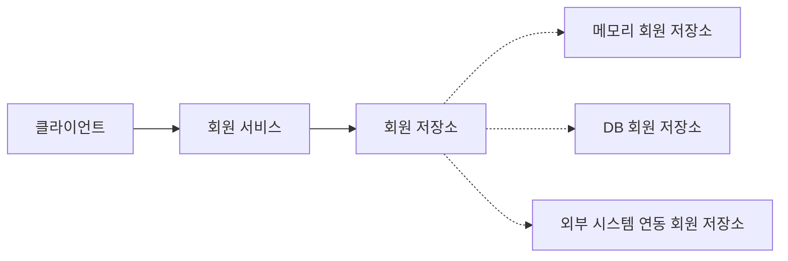
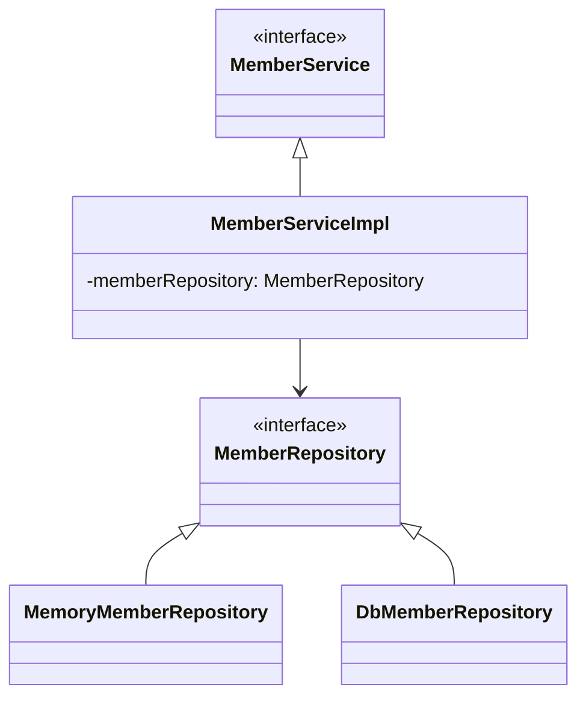

# 스프링 핵심 원리 학습 프로젝트

이 프로젝트는 스프링의 핵심 원리를 이해하기 위한 학습 프로젝트입니다. 처음에는 스프링 없이 순수 자바로만 개발을 진행하며, 이후 점진적으로 스프링의 핵심 기능을 도입하여 스프링 프레임워크가 왜 만들어졌는지, 어떤 문제를 해결하는지를 단계별로 이해합니다.

## 학습 단계

1. **순수 자바로 구현** (현재)
   - 객체 지향 원리 적용
   - 다형성과 인터페이스 기반 설계
   - 관심사의 분리

2. **스프링 도입 준비**
   - 순수 자바에서 발생하는 문제점 파악
   - DIP, OCP 원칙을 지키기 위한 고민

3. **스프링 핵심 기능 도입**
   - 스프링 컨테이너
   - 스프링 DI
   - 스프링 빈

## 프로젝트 목적

- 스프링의 핵심 원리 이해
- 객체 지향 설계 원칙 (SOLID) 학습
- 다형성과 DI(의존성 주입)의 이해
- 순수 자바로 구현하며 스프링의 필요성 이해

## 도메인 요구사항

### 회원
- 회원을 가입하고 조회할 수 있다.
- 회원은 일반과 VIP 두 가지 등급이 있다.
- 회원 데이터는 자체 DB를 구축할 수 있고, 외부 시스템과 연동할 수 있다. (미확정)

### 주문과 할인 정책
- 회원은 상품을 주문할 수 있다.
- 회원 등급에 따라 할인 정책을 적용할 수 있다.
- VIP는 1000원을 할인해주는 고정 금액 할인을 적용한다. (변경 가능)
- 할인 정책은 변경 가능성이 높다. (미확정)

## 아키텍처

### 회원 도메인 설계

#### 회원 도메인 협력 관계


- 클라이언트: 회원가입과 조회 요청
- 회원 서비스: 회원 비즈니스 로직 담당
- 회원 저장소: 회원 저장소 인터페이스
  - 메모리 회원 저장소: 개발용 임시 저장소
  - DB 회원 저장소: 실제 DB 연동용 (향후 구현)
  - 외부 시스템 연동: 외부 시스템과 연동 (향후 구현)

#### 회원 클래스 다이어그램


## 프로젝트 구조

```
src
└── main
    └── java
        └── hello
            └── core
                └── member
                    ├── Grade.java                 // 회원 등급
                    ├── Member.java                // 회원 엔티티
                    ├── MemberRepository.java      // 회원 저장소 인터페이스
                    ├── MemoryMemberRepository.java  // 메모리 회원 저장소 구현체
                    ├── MemberService.java         // 회원 서비스 인터페이스
                    └── MemberServiceImpl.java     // 회원 서비스 구현체
```

## 특징

1. 다형성과 인터페이스 기반 설계
   - 인터페이스를 통한 역할과 구현의 분리
   - 구현체 변경이 용이한 유연한 설계

2. SOLID 원칙 적용
   - SRP: 한 클래스는 하나의 책임만
   - OCP: 확장에는 열려있고 변경에는 닫혀있음
   - DIP: 추상화에 의존하고 구체화에 의존하지 않음

3. 순수 자바로 구현
   - 스프링 프레임워크 없이 순수 자바로 객체 지향 설계 학습
   - 향후 스프링 프레임워크 적용을 통한 발전 과정 이해

## 진행 상황

### 현재 구현 (순수 자바)
- [x] 회원 도메인 개발
  - 회원 엔티티
  - 회원 저장소 인터페이스
  - 메모리 회원 저장소 구현체
  - 회원 서비스 인터페이스
  - 회원 서비스 구현체

### 향후 계획
- [ ] 주문과 할인 도메인 개발
- [ ] 객체 지향 원리에 따른 설계 개선
- [ ] 스프링 컨테이너와 DI 도입
- [ ] 스프링 빈 설정

## 실행 방법

```bash
./gradlew build
./gradlew test
```

## 학습 포인트

### 현재 단계에서 고민할 점
- 관심사를 분리하고 다형성을 활용했지만 아직 OCP, DIP 원칙을 완벽히 지키지 못함
- `MemberServiceImpl`이 `MemoryMemberRepository`를 직접 생성하는 문제
- 향후 저장소 변경 시 코드를 수정해야 하는 문제

### 스프링으로 해결할 문제
- 객체 생성과 관계 설정의 분리
- DIP 완성
- 사용과 구성의 분리
